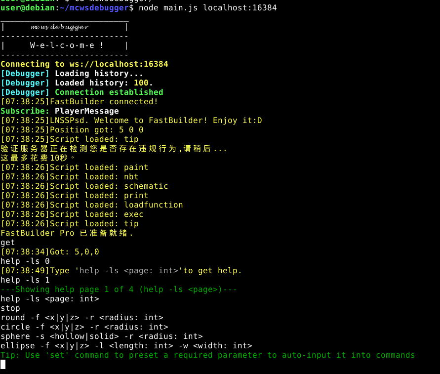

# mcwsdebugger
A Minecraft BE WebSocket server debugger that can simulate some events of Minecraft and interact with some websocket servers for Minecraft.  
Encrypted connection is also supported.  
** No longer maintained **
## Screenshots

